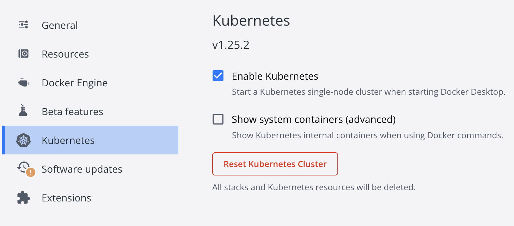

# ProgettoTAAS
Progetto esame TAAS delgi studeni Ferrero Fabio, Frumento Giulia e Monsterolo Samuele.
A.A. 2022/2023.

L'applicazione sviluppata è un social network per gli studenti universitari di Torino.  
Il progetto è strutturato nel seguente modo: 
* Sono presenti **3** microservizi indipendenti tra di loro: **balon-microservice**, **content-microservice** e 
**user-microservice**. 
    Ognuno di loro è dockerizzato come contenitore "name-service" e utilizza un proprio database.
* Il microservizio **telegram-microservice** comunica tramite RabbitMQ con content-microservice. Il compito di questo servizio
    è interrogare una canale Telegram informativo di UniTo e riportarne le notizie nella Home generale.
* Il microservizio **api-gateway** viene utilizzato così che le chiamate
ai microservizi vengano effettuate su una sola porta, ovvero la 8080. Questo permette
al consumatore (ad esempio il client) di non dover conoscere tutte le porte 
di ogni servizio per effettuare la chiamata, ma solamente la porta relativa al gateway.
* Il microservizio **eureka-server**, utilizzato come Service Discovery e Load Balancer (se sono presenti 
multiple istanze di un servizio, il server eureka si occuperà di decidere quale 
istanza dovrà eseguire la richiesta).
---
## <ins>Per eseguire con _**Docker**_ </ins>:
* Partendo dalla directory principale del progetto, navigare nella directory <code>/docker</code> eseguendo il
  comando <code>cd docker/</code>
   
   
* Una volta posizionati in <code>docker/</code>, eseguire:
  * <code>sh build-images.sh</code>  
    per creare la immagini Docker
   
   
  * <code>sh run-containers.sh</code>  
    per avviare i container, e quindi avviare l'applicazione.
    * **L'applicazione è pronta per l'utilizzo:**
    * Per verificare _server Eureka_: http://localhost:8761/
    * Per provare/testare le API: http://localhost:8080/api/<PATH_TO_API>
   
   
  * <code>sh remove-images.sh</code>  
    per interrompere l'esecuzione dei containers e rimuovere le immagini da Docker. 
    Nel caso in cui non si volessero rimuovere le immagini, anziché il comando precedente
    è possibile eseguire <code>docker compose down</code>

---

## <ins>Per eseguire con _**Kubernetes**_ </ins>:
* Partendo dalla directory principale del progetto, navigare nella directory <code>/orchestration</code> eseguendo il 
  comando <code>cd orchestration/</code>
   
   
* All'interno di questa directory (<code>orchestration/</code>) si trovano i file di configurazione di Kubernetes 
  (ovvero **Deployment / Service / Persistence** ).  
  E' possibile eseguire questi file uno a uno con il comando  
  <code>kubectl apply -f eureka.yml</code>  
  oppure eseguire lo script <code>deploy.sh</code> digitando il comando  
  <code>sh deploy.sh</code>  
  (questo comando potrebbe variare per sistema operativo. 
  In tal caso informasi come eseguire file <code>.sh</code> nel contesto del SO utilizzato).
   
   
* **<ins>NB</ins>**:  
  * Se state utilizzando **Kubernetes** su **Docker** con **minikube** è necessario
    eseguire il comando  
    <code>minikube tunnel</code>  
    per far in modo che venga effettuato il forward delle porte.  
    **Attenzione:** utilizzare Kubernetes con **minikube** su Docker potrebbe limitare la
    memoria, e quindi **_<ins>CAUSARE PROBLEMI NELL'AVVIO</ins>_**  
     
  * Se invece state utilizzando **Kubernetes** su **Docker** attraverso 
    **Docker Desktop** (**_CONSIGLIATO_**) come da foto, allora siete pronti per l'utilizzo
    (documentazione su https://docs.docker.com/desktop/kubernetes/) 
    
     
     
  * **L'applicazione è pronta per l'utilizzo:**
    * Per verificare _server Eureka_: http://localhost:8761/
    * Per provare/testare le API: http://localhost:8080/api/<PATH_TO_API>
 
 
* **ALTRI FILES**:
  * <code>remove_deploy.sh</code>: lanciare questo script una volta terminato l'utilizzo 
  dell'applicazione (verranno rimossi i Deployments / Services / PersistenceVolume creati).
  * <code>image-hub.sh</code>: lanciare questo script se si vogliono caricare le immagini
  su **Docker Hub** dopo averle modificate.
---
## <ins>ATTENZIONE</ins>:
Sia l'esecuzione con **Docker** che con **Kubernetes** implicano l'avvio del
microservizio **_telegram-service_**.
Per utilizzare questo servizio è necessario avere le credenziali
Telegram TDApi, ovvero API_KEY e API_HASH (https://core.telegram.org/api/obtaining_api_id).
Una volta ottenute, bisogna modificare i valori di questi campi (più il numero
di telefono)
in <code>src/main/java/resources/application.properties</code> nel microservizio 
sopra citato.
* Se usate **Docker** una volta partita l'applicazione vi verrà richiesto 
il codice pin che vi verrà inviato sul vostro account telegram. Potete inserirlo
da terminale.
  
* Se usate **Kubernetes**, dovete fare la stessa cosa appena descritta per 
Docker. Dovete però accedere a stdin del servizio del pod per inserire il codice.
Potete farlo digitando da terminale
<code>kubectl attach <pod-name> -c telegram-service -i -t</code>  
Per sapere il nome del container, semplicemente 
<code>kubectl get pods</code>
